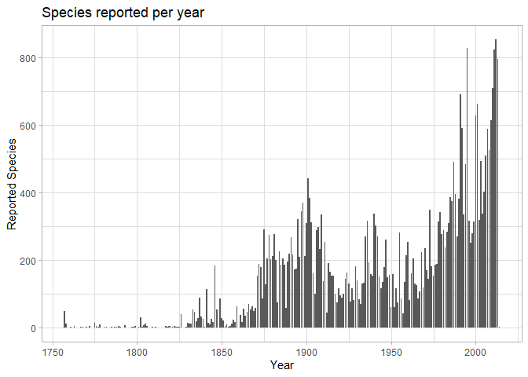
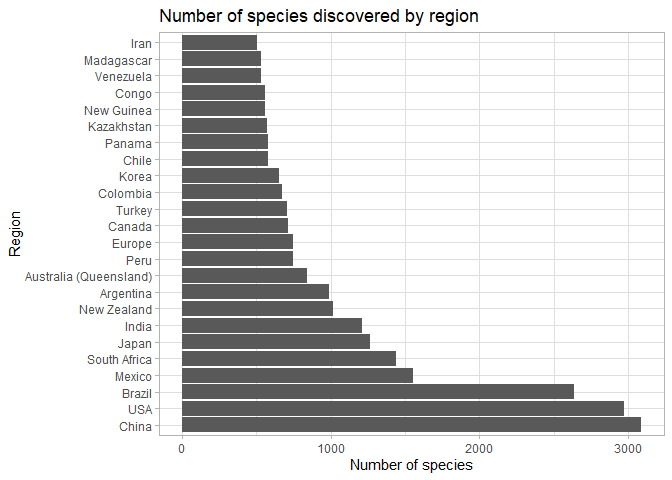

Spiders
================
RME
07/12/2021

    ## # A tibble: 6 x 10
    ##   speciesId species_lsid      family   genus  species   subspecies author   year
    ##       <dbl> <chr>             <chr>    <chr>  <chr>     <chr>      <chr>   <dbl>
    ## 1         1 urn:lsid:nmbe.ch~ Actinop~ Actin~ caraiba   NA         Simon    1889
    ## 2         2 urn:lsid:nmbe.ch~ Actinop~ Actin~ crassipes NA         Keyser~  1891
    ## 3         3 urn:lsid:nmbe.ch~ Actinop~ Actin~ cucutaen~ NA         Mello-~  1941
    ## 4         4 urn:lsid:nmbe.ch~ Actinop~ Actin~ dubiomac~ NA         Mello-~  1923
    ## 5         5 urn:lsid:nmbe.ch~ Actinop~ Actin~ echinus   NA         Mello-~  1949
    ## 6         6 urn:lsid:nmbe.ch~ Actinop~ Actin~ fractus   NA         Mello-~  1920
    ## # ... with 2 more variables: parentheses <dbl>, distribution <chr>

|                                                  |            |
|:-------------------------------------------------|:-----------|
| Name                                             | Piped data |
| Number of rows                                   | 37827      |
| Number of columns                                | 10         |
| \_\_\_\_\_\_\_\_\_\_\_\_\_\_\_\_\_\_\_\_\_\_\_   |            |
| Column type frequency:                           |            |
| character                                        | 7          |
| numeric                                          | 3          |
| \_\_\_\_\_\_\_\_\_\_\_\_\_\_\_\_\_\_\_\_\_\_\_\_ |            |
| Group variables                                  | None       |

Data summary

**Variable type: character**

| skim_variable | n_missing | complete_rate | min | max | empty | n_unique | whitespace |
|:--------------|----------:|--------------:|----:|----:|------:|---------:|-----------:|
| species_lsid  |         0 |             1 |  32 |  32 |     0 |    37827 |          0 |
| family        |         0 |             1 |   7 |  17 |     0 |      125 |          0 |
| genus         |         0 |             1 |   3 |  18 |     0 |     3605 |          0 |
| species       |         0 |             1 |   2 |  26 |     0 |    21177 |          0 |
| subspecies    |         0 |             1 |   2 |  16 |     0 |      368 |          0 |
| author        |         0 |             1 |   2 |  68 |     0 |     1946 |          0 |
| distribution  |         0 |             1 |   3 | 246 |     0 |     5002 |          0 |

**Variable type: numeric**

| skim_variable | n_missing | complete_rate |     mean |       sd |   p0 |    p25 |   p50 |     p75 |  p100 | hist  |
|:--------------|----------:|--------------:|---------:|---------:|-----:|-------:|------:|--------:|------:|:------|
| speciesId     |         0 |             1 | 19469.36 | 11223.32 |    1 | 9780.5 | 19463 | 29120.5 | 39068 | ▇▇▇▇▇ |
| year          |         0 |             1 |  1951.36 |    50.55 | 1757 | 1906.0 |  1965 |  1995.0 |  2014 | ▁▁▅▃▇ |
| parentheses   |         0 |             1 |     0.31 |     0.46 |    0 |    0.0 |     0 |     1.0 |     1 | ▇▁▁▁▃ |

Data summary

|                                                  |            |
|:-------------------------------------------------|:-----------|
| Name                                             | Piped data |
| Number of rows                                   | 37827      |
| Number of columns                                | 10         |
| \_\_\_\_\_\_\_\_\_\_\_\_\_\_\_\_\_\_\_\_\_\_\_   |            |
| Column type frequency:                           |            |
| character                                        | 6          |
| factor                                           | 1          |
| numeric                                          | 3          |
| \_\_\_\_\_\_\_\_\_\_\_\_\_\_\_\_\_\_\_\_\_\_\_\_ |            |
| Group variables                                  | None       |

**Variable type: character**

| skim_variable | n_missing | complete_rate | min | max | empty | n_unique | whitespace |
|:--------------|----------:|--------------:|----:|----:|------:|---------:|-----------:|
| species_lsid  |         0 |             1 |  32 |  32 |     0 |    37827 |          0 |
| genus         |         0 |             1 |   3 |  18 |     0 |     3605 |          0 |
| species       |         0 |             1 |   2 |  26 |     0 |    21177 |          0 |
| subspecies    |         0 |             1 |   2 |  16 |     0 |      368 |          0 |
| author        |         0 |             1 |   2 |  68 |     0 |     1946 |          0 |
| distribution  |         0 |             1 |   3 | 246 |     0 |     5002 |          0 |

**Variable type: factor**

| skim_variable | n_missing | complete_rate | ordered | n_unique | top_counts                                 |
|:--------------|----------:|--------------:|:--------|---------:|:-------------------------------------------|
| family        |         0 |             1 | FALSE   |      125 | Sal: 5511, Lin: 4406, Ara: 2911, Gna: 2377 |

**Variable type: numeric**

| skim_variable | n_missing | complete_rate |     mean |       sd |   p0 |    p25 |   p50 |     p75 |  p100 | hist  |
|:--------------|----------:|--------------:|---------:|---------:|-----:|-------:|------:|--------:|------:|:------|
| species_id    |         0 |             1 | 19469.36 | 11223.32 |    1 | 9780.5 | 19463 | 29120.5 | 39068 | ▇▇▇▇▇ |
| year          |         0 |             1 |  1951.36 |    50.55 | 1757 | 1906.0 |  1965 |  1995.0 |  2014 | ▁▁▅▃▇ |
| parentheses   |         0 |             1 |     0.31 |     0.46 |    0 |    0.0 |     0 |     1.0 |     1 | ▇▁▁▁▃ |

<!-- -->

lets look at countries

    ## Warning: Expected 15 pieces. Missing pieces filled with `NA` in 37824 rows [1,
    ## 2, 3, 4, 5, 6, 7, 8, 9, 10, 11, 12, 13, 14, 15, 16, 17, 18, 19, 20, ...].

<!-- -->
